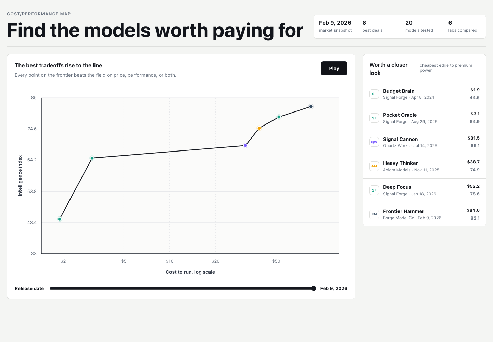

# Pareto Frontier Visualizer

Stop asking which model is best. Ask which one is worth its price.



This React + TypeScript app turns a plain CSV into a clean cost/performance map.
It shows which models, tools, or products are currently Pareto-optimal across two
dimensions: higher score and lower cost.

The included dataset is synthetic, but the pattern is deliberately generic. Swap
in any CSV with a release date, cost metric, score metric, owner, and display
color.

## What It Does

- Parses a CSV at build time.
- Filters rows with invalid dates, missing scores, or non-positive costs.
- Computes the "worth paying for" frontier for every release-date cutoff.
- Animates the frontier over time with a slider or play button.
- Shows branded points with `simple-icons` where available.
- Includes a Remotion composition for rendering a vertical social video.

## Quick Start

```sh
npm install
npm run dev
```

Open the local Vite URL that appears in your terminal.

## Build And Check

```sh
npm run lint
npm run build
```

## Render The Video

```sh
npm run video:preview
npm run video:render
```

The render command writes `out/pareto-frontier.mp4`. The `out/` directory is
ignored by git.

## Use Your Own Data

Replace `src/data/pareto_intelligence_vs_cost.csv` with your own CSV. Required
columns are documented in `src/data/README.md`.

The frontier logic lives in `src/pareto.ts`, so adapting the app usually means:

1. Rename the score and cost labels in `src/App.tsx`.
2. Replace the CSV with data you can publish.
3. Update or remove creator icons in `src/logos.ts`.
4. Adjust the video copy in `src/remotion/ParetoVideo.tsx` if you use Remotion.

## Security And Privacy

This repo is intentionally static. It does not need API keys, OAuth tokens,
cookies, browser profiles, account identifiers, or server-side credentials.

Before publishing your own fork, scan any replacement dataset for private
vendor names, customer names, internal URLs, account IDs, and unpublished
pricing.

## Included Data

The included sample CSV is synthetic. If you replace it with data from a
third-party source, keep that source's attribution and redistribution terms with
your version.
